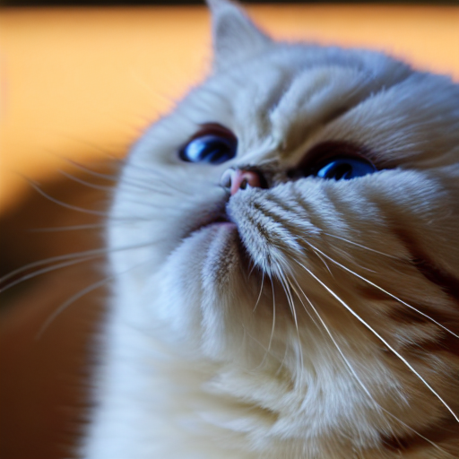

# [DreamBooth](https://github.com/huggingface/diffusers/tree/main/examples/dreambooth) by [colossalai](https://github.com/hpcaitech/ColossalAI.git)

[DreamBooth](https://arxiv.org/abs/2208.12242) is a method to personalize text2image models like stable diffusion given just a few(3~5) images of a subject.

- The model used in the experiment

        The base model is CompVis/stable-diffusion-v1-4.

- The dataset employed

        The images are from a British short hair cat of my friends, Ye Tong.

- Parallel settings (if any)

        This experiment is conducted on a 4-V100 machine of a GPU cloud server.

        The parallel setting is the same as defaults. World_size = 4.

- Instructions on how to run your code

        When you want to train the model:

```bash
bash ./colossalai.sh > train.log 2>&1
```

        If you have trained the model, and want to do inference:

```bash
python inference.py > inference.log 2>&1
```

- Experiment results

        The log of the experiment is named as train.log/inference.log

        The generated image is named as output.png

        The image below is an example for inference (Its prompt is "a photo of British Short hair Cat.")

